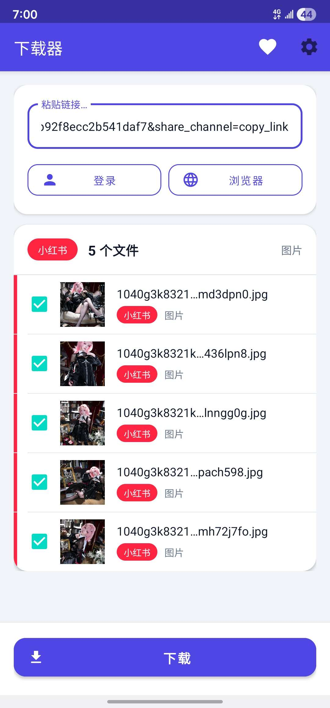

# MediaSave

An Android app for downloading photos and videos from Instagram, X (Twitter), RedNote (小红书), and Douyin (抖音).

## Screenshot

<p align="center">
  
</p>

## Features

- Download photos and videos from Instagram posts and reels
- Download photos, videos, and GIFs from X (Twitter) posts
- Download photos and videos from RedNote (小红书 / XiaoHongShu) notes
- Download videos and image sets from Douyin (抖音) posts
- Supports multi-photo carousel posts on all platforms
- Thumbnail previews — every found item shows a preview image in the list
- Selective download — pick exactly which items to save with per-item checkboxes
- Optional third-party resolver for Douyin (greenvideo.cc), toggleable in Settings — also captures the separate audio track
- Persistent login — log in once per platform, session is saved automatically
- Share a URL directly from any supported app to open it instantly
- Press back twice to exit — temporary cache is cleared, downloaded files are kept

## Usage

### Instagram

#### Method 1: Share from Instagram

1. Open a post in the Instagram app
2. Tap **Share → Copy Link** or **Share to...** and select this app
3. The post loads automatically
4. Select the items you want and tap **Download** to save

#### Method 2: Paste a URL

1. Open the app
2. Paste an Instagram URL into the input bar (e.g. `https://www.instagram.com/p/ABC123/`)
3. The page loads automatically after pasting
4. Select the items you want and tap **Download** to save

### X (Twitter)

#### Method 1: Share from X

1. Open a post in the X app
2. Tap **Share → Copy link to post** or **Share to...** and select this app
3. The post loads automatically
4. Select the items you want and tap **Download** to save

#### Method 2: Paste a URL

1. Open the app
2. Paste an X URL into the input bar (e.g. `https://x.com/username/status/1234567890`)
3. The page loads automatically after pasting
4. Select the items you want and tap **Download** to save

### RedNote (小红书)

#### Method 1: Share from RedNote

1. Open a note in the RedNote app
2. Tap **Share → Copy Link** or **Share to...** and select this app
3. The note loads automatically
4. Select the items you want and tap **Download** to save

#### Method 2: Paste a URL

1. Open the app
2. Paste a RedNote URL into the input bar (e.g. `https://www.xiaohongshu.com/explore/ABC123`)
3. The page loads automatically after pasting
4. Select the items you want and tap **Download** to save

### Douyin (抖音)

#### Method 1: Share from Douyin

1. Open a video in the Douyin app
2. Tap **Share → Copy Link** or **Share to...** and select this app
3. The video loads automatically
4. Select the items you want and tap **Download** to save

#### Method 2: Paste a URL

1. Open the app
2. Paste a Douyin share link into the input bar (e.g. `https://v.douyin.com/iXxxxxx/`)
3. The page loads automatically after pasting
4. Select the items you want and tap **Download** to save

### Selecting which files to download

Once media is found, each item appears in a list with a **thumbnail preview** and a **checkbox** (all checked by default). Untick anything you don't want, then tap **Download** to save only the selected items. The header shows how many files were found.

### First-time login

If you are not logged in, the app will show the platform's login page. Log in once — your session is saved and you won't need to log in again.

> **Douyin note:** A guest session works for most public videos without logging in. Login is only required for private accounts. You can also enable an optional third-party resolver — see [Settings & About](#settings--about) below.

> **Audio:** When the third-party resolver is used, Douyin video posts also expose their separate audio track as an `.mp3` item in the list, which you can select or skip like any other item.

### Settings & About

Tap the **gear icon** in the top-right toolbar to open Settings / About:

- App overview and version number
- Link to this source repository
- **Use third-party site for Douyin** — a pill toggle. When enabled, Douyin links are resolved via [greenvideo.cc](https://greenvideo.cc/) instead of the built-in extractor (the built-in mechanism is unchanged when the toggle is off). The app loads greenvideo.cc in a hidden WebView, submits the link automatically, and captures the resulting watermark-free video, audio, and image direct-links into the download list. No login is required.

### Exiting & cache

Press **back twice** to fully exit the app. This clears the temporary cache (WebView cache, thumbnails) but **keeps your login sessions and any files already saved to your phone**.

### Downloaded files

Files are saved to:
```
/storage/emulated/0/Download/Instagram/   ← Instagram
/storage/emulated/0/Download/Twitter/     ← X (Twitter)
/storage/emulated/0/Download/RedNote/     ← RedNote
/storage/emulated/0/Download/Douyin/      ← Douyin
```

## Build

### Requirements

- Android Studio or JDK 17+
- Android SDK (API 24+)

### Build locally

```bash
./gradlew assembleDebug
```

Output: `app/build/outputs/apk/debug/app-debug.apk`

### Build via GitHub Actions

Push to `main` or `master` — the APK is built automatically and available under **Actions → Artifacts**.

## Requirements

- Android 7.0 (API 24) or higher
- Internet connection
- Accounts for platforms with private content (optional for Douyin)

## License

This project is licensed under the [GNU General Public License v3.0](LICENSE).
